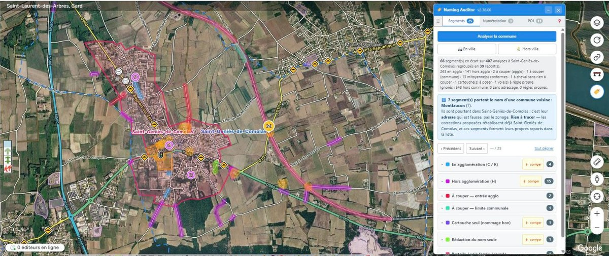
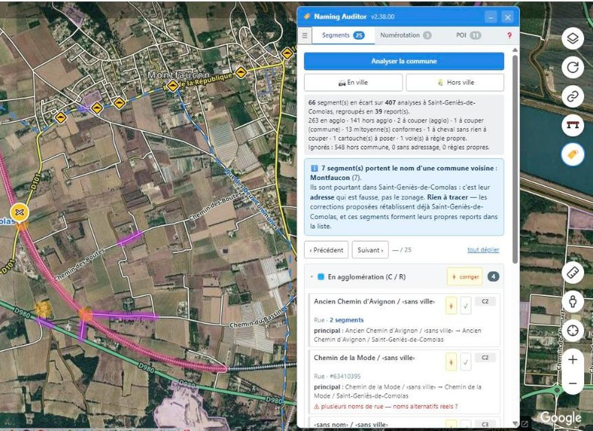
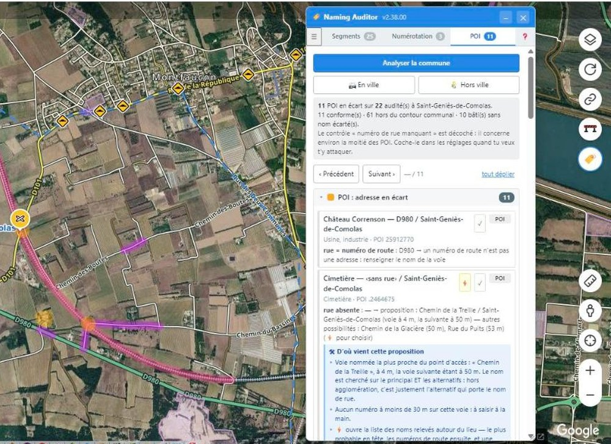
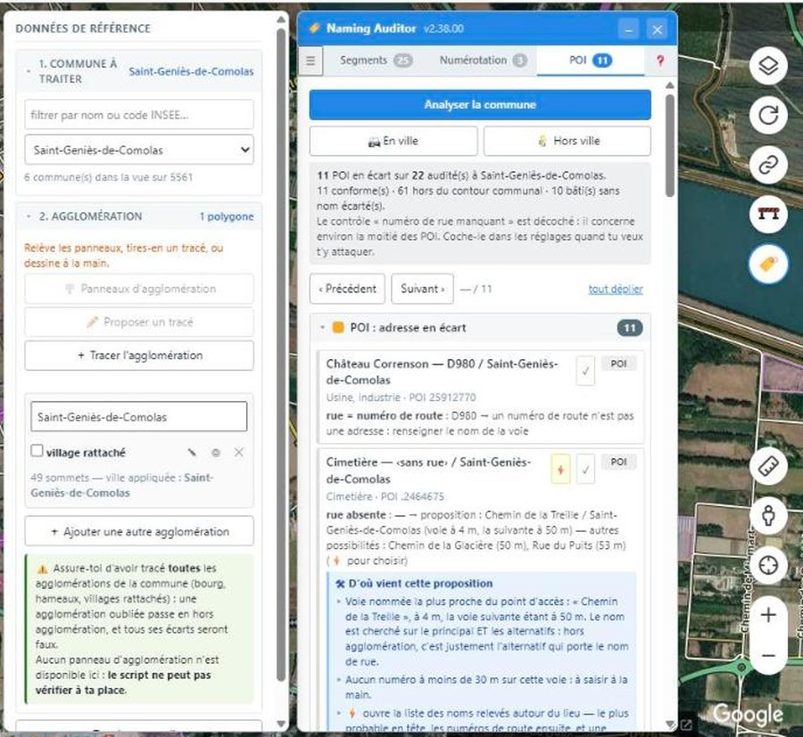

# WME Naming Auditor

Userscript pour l'éditeur de cartes Waze (WME). Il audite le **nommage des segments** — nom principal et noms alternatifs — ainsi que l'**adressage** (numéros de rue, POI résidentiels, adresse des lieux), en s'appuyant sur les **contours communaux officiels** et sur un **polygone d'agglomération** tracé à la main, puis liste les écarts à la règle.

> **Le script ne modifie ni n'enregistre jamais rien tout seul.** Il lit, compare et propose. Une correction proposée est déposée dans WME exactement comme une saisie manuelle : elle se relit, elle s'annule (Ctrl+Z), et **c'est l'éditeur qui enregistre**.

## Le principe

La règle française de nommage bascule à l'entrée d'agglomération (panneau EB10) :

- **en agglomération** : la ville est renseignée, le nom de rue est le nom principal, le numéro de route passe en alternatif ;
- **hors agglomération** : le nom principal ne porte **pas** de ville, le numéro de route devient le nom principal, et le nom de rue passe en alternatif **avec** la ville.

Le script ne peut pas voir les panneaux. Il déduit donc la zone de deux géométries :

1. le **contour communal** (fichier GeoJSON chargé par l'éditeur) délimite le périmètre d'analyse et fournit le nom de commune ;
2. le **polygone d'agglomération**, tracé à la main à l'intérieur, sépare l'agglomération du reste.

Un segment à cheval est tranché par un **seuil de longueur réglable** (80 % par défaut). Entre les deux, aucune correction n'est proposée : le segment est signalé comme **à couper**, puisque le bon nommage dépend de l'endroit de la coupure.

Trois exceptions, où il n'y a rien à couper : la voie **mitoyenne** qui épouse la limite communale, le segment qui ne porte **ni nom ni ville** (les deux moitiés seraient identiques), et l'**autoroute**, qui ne porte aucune ville quelle que soit la zone. Le bilan les compte à part plutôt que de les taire.

Le script ne **crée** jamais un nom ni un numéro : il réorganise ce qui est déjà saisi. Seule la ville peut venir d'ailleurs — du contour communal.

## Mise en route

1. Installer `WME-Naming-Auditor.user.js` dans Tampermonkey (accepter l'autorisation d'accès à `geo.api.gouv.fr`).
2. Dans WME, ouvrir l'onglet 🏷️ du panneau latéral (**Scripts**), puis **Afficher la fenêtre**.
3. Cocher un ou plusieurs départements et cliquer sur **Télécharger et charger** : les contours arrivent directement, sans passer par un fichier.
4. Choisir une commune, tracer son agglomération, analyser.

Les contours peuvent aussi venir d'un **fichier GeoJSON** que vous fournissez — utile hors ligne, ou pour employer une autre source que celle proposée. L'outil `Recuperer-Communes.html` fabrique ce fichier depuis un navigateur, indépendamment du script.

## Ce qui est contrôlé

Chaque contrôle s'active ou se désactive séparément, dans l'onglet du panneau latéral.

| Contrôle | Objet |
|---|---|
| Nommage agglo / hors agglo | le cœur : ville, nom principal, alternatifs |
| Cartouches | les numéros de route doivent porter leur écusson |
| Bretelles | jamais de ville ; format de la direction (`A4: Reims`) |
| Autoroutes | jamais de ville, quelle que soit la zone — et aucune coupe aux limites |
| Voies ferrées, pistes, ferries | jamais de ville ; nom principal vide, alternatif admis |
| Rocades et périphériques | jamais de ville |
| Giratoires | sans nom ; la ville suit la zone |
| Abréviations | `Av.`, `Bd.`, `Rte`… interdits |
| Contractions | `St-`, `R. Poincaré`… interdits |
| Majuscule initiale | nom commençant par une minuscule |
| Fonction ou direction | `Voie de bus`, `… : Marseille` |
| Rédaction | confronte le nom au dictionnaire communautaire français de **WME Check Road Name** |
| Numérotation | numéros de rue hors agglomération, POI résidentiels, doublons |
| POI | adresse des vrais lieux — rue, commune, numéro. Les aires, échangeurs, jonctions et péages relèvent d'une règle propre : leur adresse est le **nom de l'autoroute**, sans ville |

Les segments dans une situation strictement identique sont regroupés en un seul report ; un clic les sélectionne tous.

## À quoi ça ressemble

Chaque report montre l'état actuel et l'état proposé, champ par champ. Le ⚡ applique la correction dans WME — sans l'enregistrer.

Sur les POI, le script **dit d'où vient sa proposition** : quelle voie, à quelle distance, et sur quel critère. Une proposition qu'on ne peut pas vérifier ne se corrige pas de confiance.

Tout part de deux géométries, à préparer une fois par commune : le contour officiel, et l'agglomération tracée à la main.

## Mise à jour

Une pastille rouge apparaît dans l'en-tête de la fenêtre quand une version plus récente est publiée sur GreasyFork ; le clic ouvre sa page. Elle reste éteinte si la version installée est à jour, **et aussi hors ligne** : elle ne s'allume que sur une réponse claire, jamais par précaution.

## Autres pays

Le moteur ne connaît aucune règle nationale. Tout le franco-français est isolé dans un **référentiel** (`REFERENTIELS.FR`) qui décrit le vocabulaire des numéros de route, les types de voies sans adressage, les clés du fichier de contours, l'état cible du nommage et la liste des contrôles. Ajouter un pays revient à écrire un second référentiel, sans toucher au moteur ni à l'interface — celle-ci se construit à partir de ce qu'il déclare.

## Données de contours

`Recuperer-Communes.html` interroge l'API Découpage administratif de l'État (`geo.api.gouv.fr`), dont les contours proviennent d'**Admin Express (IGN)** et du Code Officiel Géographique de l'**INSEE**. À ne pas confondre avec les nombreux jeux de contours dérivés d'OpenStreetMap, sous licence ODbL.

Le fichier reste sur le poste de l'éditeur.

Le script joint six hôtes, et seulement ceux-là (déclarés en `@connect`) : `geo.api.gouv.fr` pour les contours, `api.wazefrance.com` comme source de contours alternative, `docs.google.com` et `googleusercontent.com` pour le dictionnaire de rédaction, `raw.githubusercontent.com` pour charger un fichier de partage par son adresse, et `update.greasyfork.org` pour savoir si une version plus récente est publiée.

Ce sont toutes des **lectures** : le script n'envoie aucun contenu. Les seuls paramètres transmis sont un **numéro de département** et, pour savoir lequel est sous les yeux, les **coordonnées de la vue** (latitude, longitude). **Rien de ce que vous éditez ne quitte le navigateur.**

## Licence

MIT — voir `LICENSE`.
